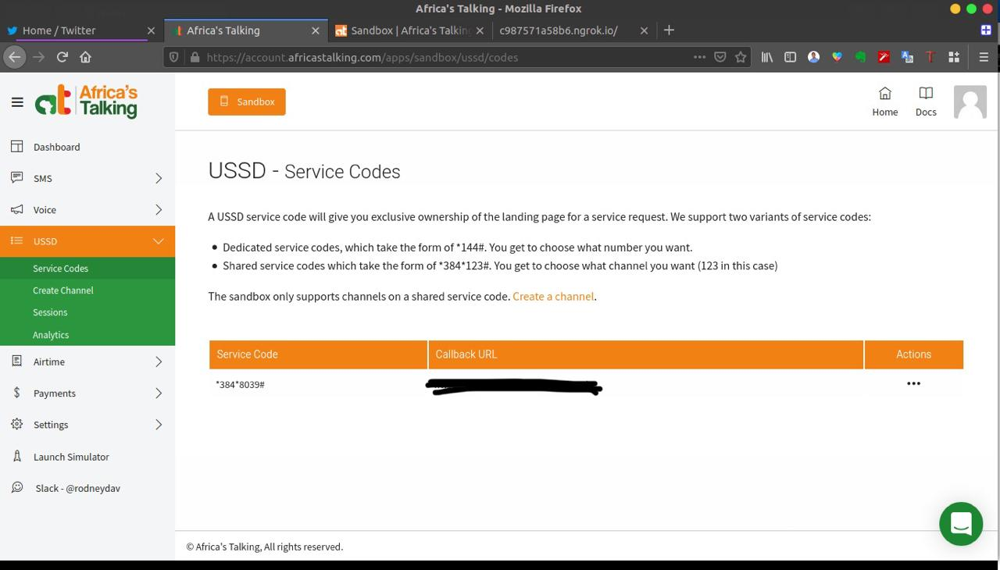
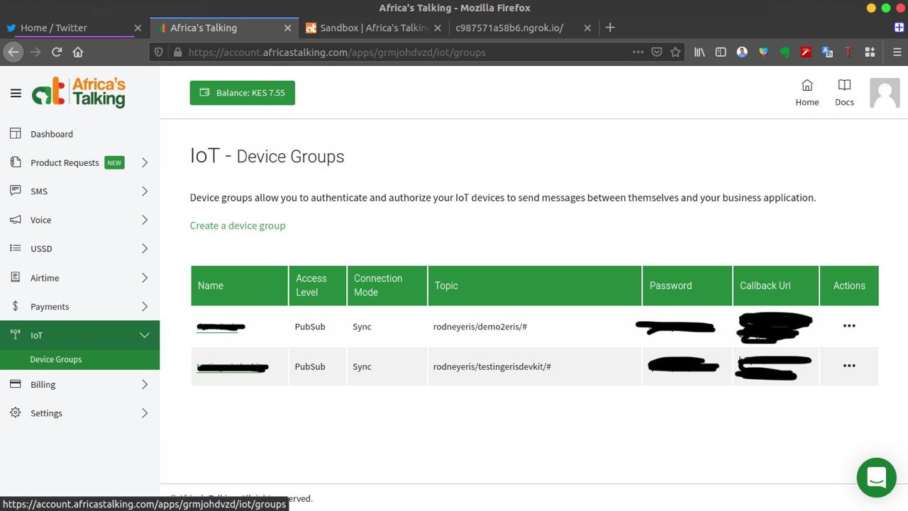
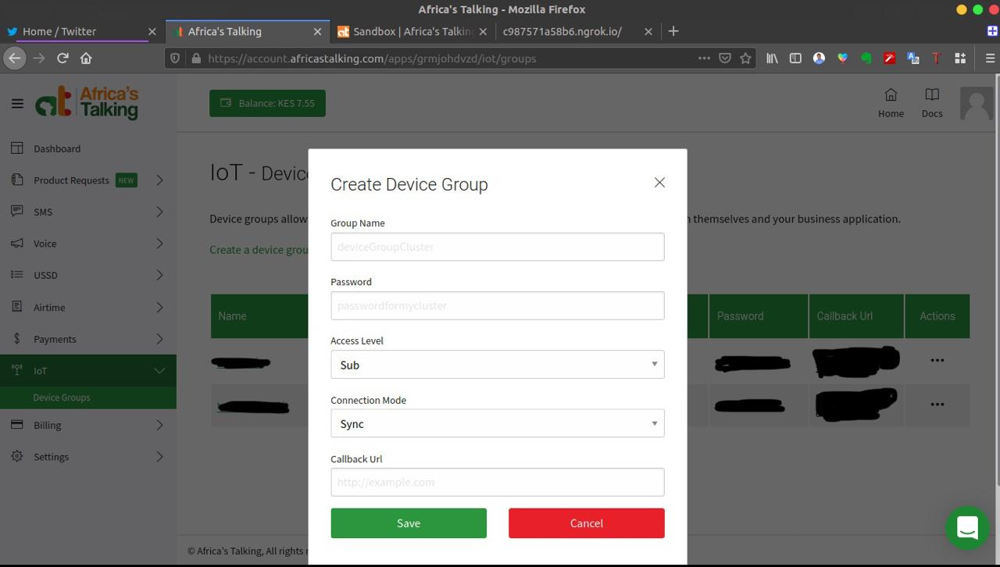
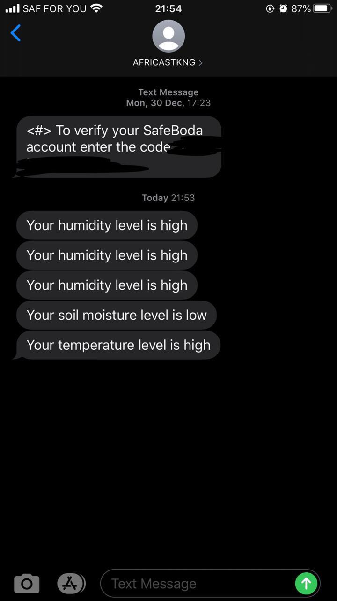
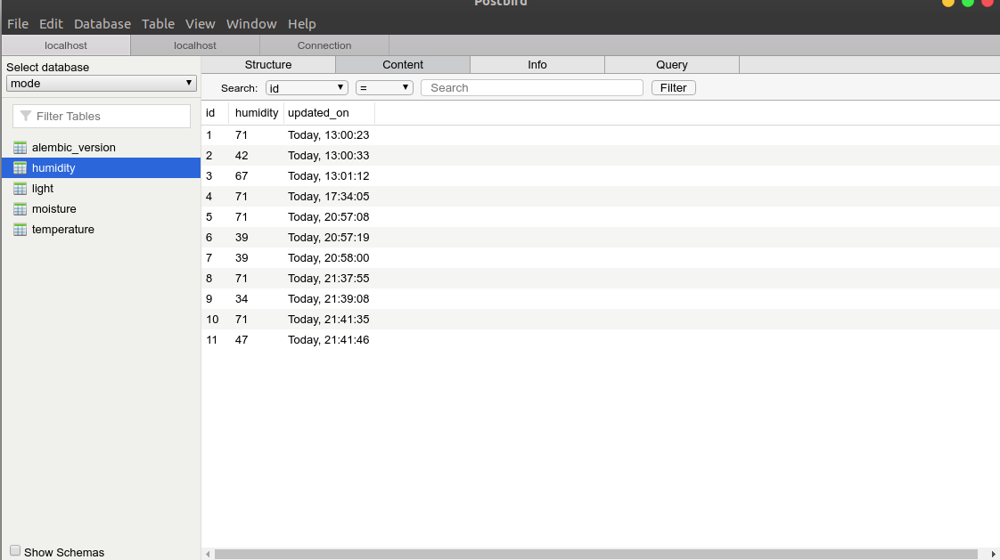
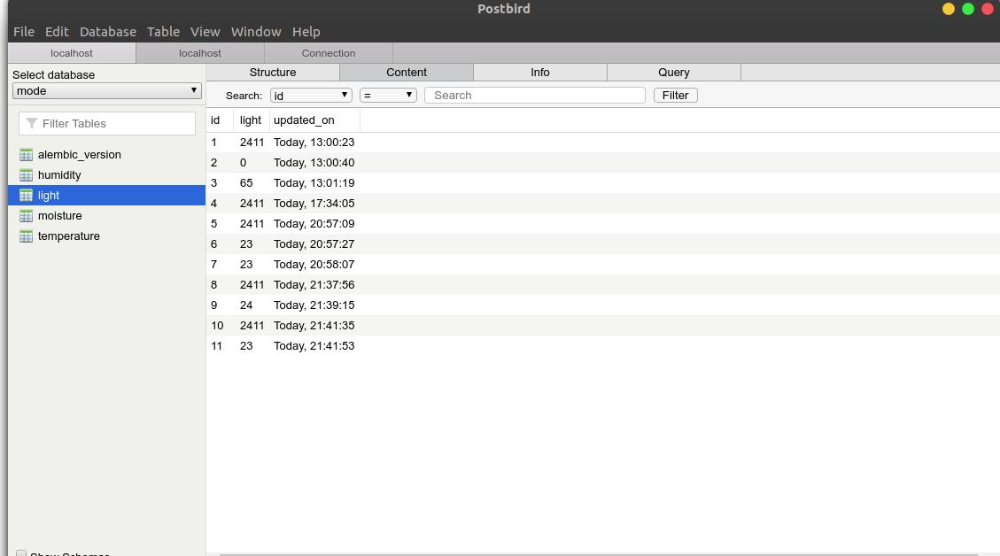
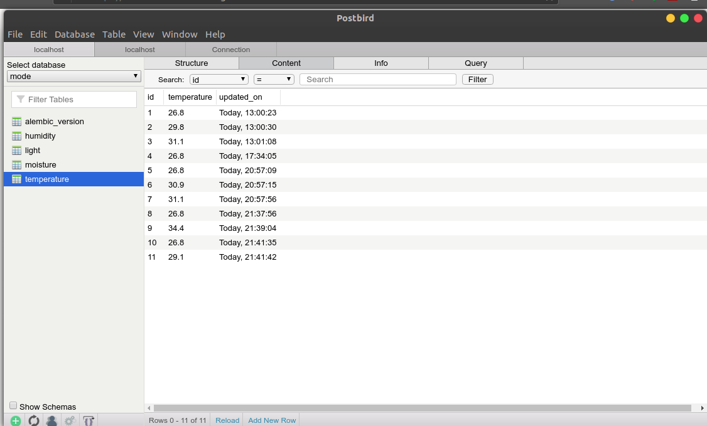
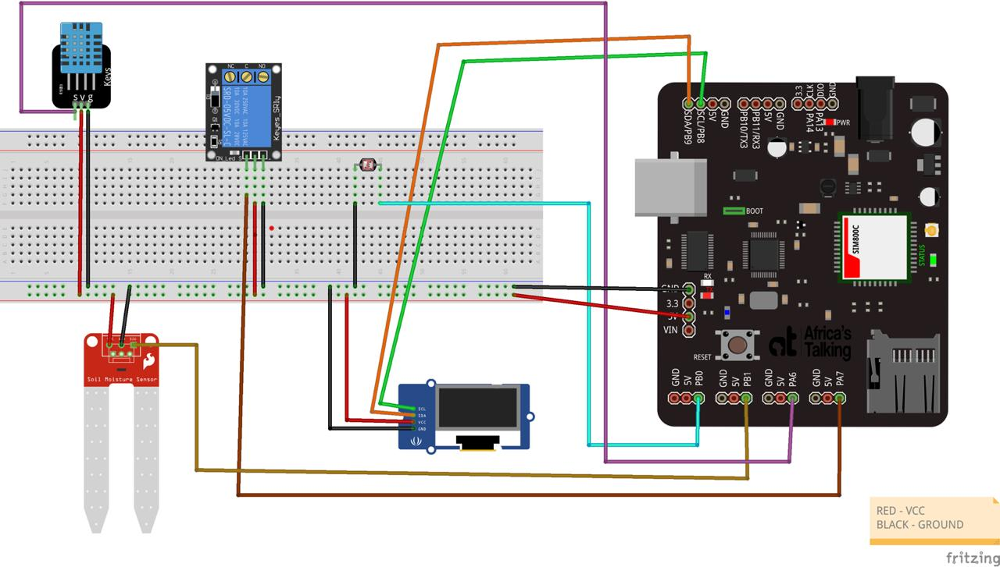

# smart-farm-africastalking-hackathon
Project, smart farm, to be demoed at africastalking hackathon for their eris V1 dev kit.


# Introduction
## Hardware 
Basically this is prototype device for smart farming. The smart farm has DHT11 sensor which measures temperature and humidity, light dependent resistor whihc measures light intensity and soil moisture sensor which measures soil moisture content. We have and irrigation system  and fan system symbolized by a solid state relay. When the soil moisture is low the eris dev kit automatically starts the irrigation system to raise the soil moisture content. If the soil moisture raises until it reaches a certain level the irrigation system is closed. When the temperature is high the fan and irrigation system are turned on in order to reduce the temperature of the micro climate. If it drops to a certain level the two systems are stopped. When the humidity is low the irrigation system which is overhead the crops is started in order to raise the humidity to optimum levels. If it is high the irrigation system is stopped. For light intensity we are tracking the records to be able to make better decisions in the future maybe by data analysis.

The micro controller generally measures all the paramters after every minute and sends it to the africa's talking IoT API. Meanwhile the date is also shown on an oled screen on the eris dev kit. For sending the data we are using MQTT protocol and we are sending it via the network of Safaricom. This is to meand that the eris dev kit has a Preconfigured sim card to send data to Africa's Talking API.

## Backend App
This is the callback applications which listens to all the incoming and is also repsonsible for outgowing messages. This applications has USSD and SMS services for the farming. In the future I will implement a voice applications. The USSD app is responsible for displaying the data of the farm to the user. It has wide range of use cases spanning from getting data from any date to starting or stoping irrigation. The sms service sends a daily average at the end of the day and also sends alert on any extreme conditions.

## Usage

[](https://youtu.be/OunLw0YObY4)

### Build ther arduino file

### Third Party Libraries

| Library              | Function                            | Source                                                                                      |
| -------------------- | ----------------------------------- | ------------------------------------------------------------------------------------------- |
| MQTT Client(Eclipse) | Handling MQTT Client Connection     | [Eclipse.org](https://www.eclipse.org/downloads/download.php?file=/paho/arduino_1.0.0.zip)  |
| Tiny GSM             | Handling GSM Module connection      | [TinyGSM](https://github.com/vshymanskyy/TinyGSM)                                           |
| DHT                  | High level wrapper for DHT sensors  | [Adafruit](https://github.com/adafruit/DHT-sensor-library)                                  |
| U8x8lib              | High level wrapper for OLED display | [olikraus/u8g2](https://github.com/olikraus/u8g2)                                           |


1. Go to `Hardware/hardwareapp` then create a `config.h` file. This will hold you config Variables
2. Inside the `config.h` add
```c++
// This is your application username that is associated with your IoT Appplication
#define APPLICATION_USERNAME "rodneydemo" 
// This is the device group that the IoT device is to connect to 
#define DEVICE_GROUP_NAME "rodneygroup"
// This is the device identifier that is sent to the Africa's Talking Broker
#define DEVICE_ID "rodneykit"
// This is the devive group password that the IoT device is to use to establish a connection
#define DEVICE_GROUP_PASSWORD "$%rodneypassword$%"
// This will resolve to <username>:<device-group>
#define MQTT_CREDENTIALS APPLICATION_USERNAME ":" DEVICE_GROUP_NAME
// This will always start with <username>/<device-group>/
#define TOPIC_PREFIX APPLICATION_USERNAME "/" DEVICE_GROUP_NAME "/"
// Safaricom APN
#define SAF_APN "iot.safaricom.com"
// Africa's Talking broker url
#define BROKER_ADDRESS "broker.africastalking.com"
// Africa's Talking broker port
#define BROKER_PORT 1883
```
3. Reset the board the build

### Setup callback
Have Make docker and ngrok installed

1. Create a `broker.env` file with the following configs
```python
MQTT_HOST = "broker.africastalking.com"
MQTT_PORT = 1883
MQTT_USERNAME = "rodneydemo:athackathons"
MQTT_PASSWORD = "$#Password$%^&*("
CLIENT_ID = "rodneyclient"
FARMER_NUMBER = "+2547XXXXXXXX"
AT_PASSWORD = "XXXXXXXXXXXXXXXXXXXXXXXXXXXXXXXXXXXXXX"
AT_USERNAME = "rodneyXXXXX"
```
2. Start postgres database as a docker container

```shell
make start-postgres
```
3. Install requirements

```shell
pip3 install -r requirements.txt
```
4. Export configs

```shell
make export-config
```

5. initialize flask app

```shell
make initialize-app
```
6. Run ngrok

```shell
make start-ngrok
```
7. Copy your callback url you will use it later

### Setup Africa's Talking Account 

#### USSD (Sandbox) 

1. In your Sandbox account, navigate to the USSD blade and click on "Create Channel"


  
2. In the channel creation form, add an USSD shortcode number, and in the callback URL field add the your app URL and append `ussd`. Example if your Heroku app url in 4 above is `https://mycoolapp.herokuapp.com/` then your USSD callback should be `https://mycoolapp.herokuapp.com/ussd`. 


 

3. Save and in the end you should have something like shown above

 

#### IoT (Live) 

1. Inside your AT IoT account, Click on the `...` under the `Actions` tab for the  device group you'd like to configure the callback for and update the callback URL to `iot`. Example if your Heroku app url  above is `https://mycoolapp.herokuapp.com/` then your IoT callback should be `https://mycoolapp.herokuapp.com/iot`. 


 

#### The Simulator (Sandbox) 

1. Navigate to the [AT Sandbox Simulator page](https://simulator.africastalking.com:1517/). Enter a valid phone number.


2. Click on the USSD option


3. Dial your USSD code. If your short code above was 1000, enter `*384*1000#` and press the `Call` button for magic!


4. [Demo](https://youtu.be/OunLw0YObY4) is 


6. SMS Alerts 

7. Data in my database:


   1. 
   2. 
   3. 
   
## Wiring


